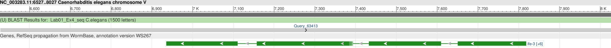

# Task 1

## Task 1.1

diploid population = Aa,Aa = 2N (parents)

After random mating for first generation: children = AA, Aa, aA, aa


Total new first gneration population = 4

Number of AA homozygtes = 1

Number of aa homozygotes = 1

Number of Aa or aA hereterozygotes = 2

Proportion of AA homozygtes = 1/4 = 0.25

Proportion of aa homozygotes = 1/4 = 0.25

Proportion of Aa or aA hereterozygotes = 2/4 = 0.5


The proportion AA Homozygotes : Aa Heterozygotes : aa homozygotes is 

0.25: 0.5 : 0.25


Again after random mating for first generation:


Probability of getting A allele = 3/6 = 0.5 = p


Probability of getting a allele = 3/6 = 0.5 = q

The proportion AA Homozygotes : Aa Heterozygotes : aa homozygotes is also

square of p : 2 times p times q : square of q

(0.5)^2 : 2 times 0.5 times 0.5 : (0.5)^2

0.25: 0.5 : 0.25


This satisfies the Hardy Weinberg equilibrium.


### Task 1.1.b

The probabibility of getting A allele and a allele will remain the same with continued random mating therefore the Hardy Weinberg equilibrium will always hold.


## Task 1.2


Total number of people = 357 + 485 + 158 = 1000

Total allele population = 2 times 1000 = 2000

Total number of M is 2 times 357 added to 485 = 1199

Total number of N is 2 times 158 added to 485 = 801

Probability of getting M is 1199 out of 2000 = 0.5995 (assuming diploid)

Probability of getting N is 801 out of 2000 = 0.4005 (assuming diploid)

Creating vector of number of homozygotes and heterozygotes, R

Creating vector of Probabilities of M and N alleles, S

```{r}
R <- c(357, 485, 158)
S <- c(0.5995*0.5995, 2*0.5995*0.4005, 0.4005*0.4005)

chisq.test(R, p=S)

```

The null hypothesis under the chi-square test for goodness of fit, that the population follows the Hardy Weinberg equilibrium, IS ACCEPTED.


# Task 2

## Task 2.1

According to the information in the FEATURES section, the protein product is **RecQ type DNA helicase**

## Task 2.2

The first four amino acids are MVVA, which is **Methionine, Valine, Valine and Alanine**

## Task 2.3

Attached "after_backtranseq.FASTA"

## Task 2.4

The coding strand sequence obtained from using "backtranseq" exactly matches the nucleotide sequence provided. For instance, the last letter **"D"** representing **Aspartic acid** exactly macthes the last three letter sequence **"GAT"**

After reversing and complementing, the nucleotide sequence is in the 3' to 5' prime direction but amino acid contents are exactly the same. For example, the third amino acid in the reversed and complemented nucleotide sequence is **"AAC"** which is the same as the **"GTT"** in the sequence produced by "backtranseq", which is also the same as **"V"**. 

Attached is "after_reverse_complement.FASTA"


## Task 2.5

The nucleotide number range is **1 to 5661** and there is no stop codon which means that the gene is incomplete. The genome lies on chromosome *I*.


# Task 3

## 3.1

According to Wikipedia, C. elegans is being extensively used as a model organism.It was the first multicellular organism to have its whole genome sequenced, and as of 2012, is the only organism to have its connectome (neuronal "wiring diagram") completed. The C. elegans genome contains an estimated 20,470 protein-coding genes. About 35% of C. elegans genes have human homologs. Remarkably, human genes have been shown repeatedly to replace their C. elegans homologs when introduced into C. elegans. Conversely, many C. elegans genes can function similarly to mammalian genes.


## 3.2

\
\


\
\


## 3.3

The database genomic sequence progresses from 6529 to 8028, and the query sequence from 1 to 1500, both essentially in the same direction.

When the query sequence is reverse complemented, it runs in the direction which is from 8028 to 6529, opposite to 1 to 1500.

However, the two look exactly the same in the Genome Data Viewer.


## 3.4

The query sequence is found on chromosome V and positions are **6936 to 7110 for exon **, **7158 to 7393 for exon 2**, **7433 to 7609 for exon 3**, and **7651 to 7818 for exon 4**


## 3.5

protein code of exon 1: **MSTSVAENKALSASGDVNASDASVPPELLTRHPLQNRWALWYLKADRNKEWEDCLK**

protein code of exon 2:
**LNTSFIDFFQMVSLFDTVEDFWSLYNHIQSAGGLNWGSDYYLFKEGIKPMWEDVNNVQGG**

protein code of exon 3:
**RRTQLLDHYWLELLMAIVGEQFDEYGDYICGAVVNVRQKGDKVSLWTRDATRDDVNLRIGQVLKQKLSIPDTEILR**

protein code of exon 4:
**YEVHKDSSARTSSTVKPRICLPAKDPAPVKEKGPAATTSPSNPGTEATGTSPATPTP***


## 3.6

The lineage is Eukaryota; Metazoa; Ecdysozoa; Nematoda; Chromadorea; Rhabditida; Rhabditoidea; Rhabditidae; Peloderinae; Caenorhabditis. It is a **protein coding gene type**.


