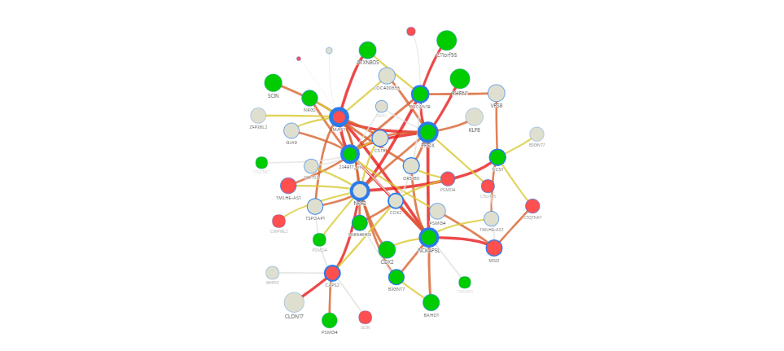

## Task 2


```{r include=FALSE}
load("Rosetta_Lab5.RData")
#library(R.ROSETTA)
# autconDefault = rosetta(autcon)
autconDefault
```

```{r echo=TRUE}
table(autcon$decision)
```

The autcon data set has 146 obsercations and each has 36 features. Above we can see how the data set is devided in two groups. We can see that the distribution is 56%-44% which is quite balanced

## Task 3


a) Cross validation is a method which helps us to approximate the error. The default value in Rosetta function is 10 and this method works in a way that data is devided in this case to 10 groups and each time nine of those are use for training and one for testing. The mean of the obtained errors should be an approximation of the total error.

b) The default reduction method is Johnson. This method is used for finding the shortest path in the graph therefore, to find the rules.

c) The default method for discretization is EqualFrequency method and there are used 3+1 = 4 bins. This method simply creates a partition into n+1 bins with 3 cuts in equal length.

```{r echo=TRUE}
autconDefault$quality
```

d) The accurancy of the model is shown above. we can see that it is about 80%

```{r echo=TRUE}
autconDefault$main[1:3,]
table(autconDefault$main[which(autconDefault$main$PVAL <0.05),]$DECISION)
```
e) We obtained 191 rules. Above we can see 3 most significant rules and also we can see the distribution of the classes with more significant rules.

## Task 5



At the picture we can see how the network looks like. We found the following strongest connections in the graph 
MAP7=3 - NCKAP5L=1 (conn: 38.3052), NCKAP5L=1 - PPOX=1 (conn: 38.0476),  NCS1=1 - NPR2=2 (conn: 38.0952)

And following most significant nodes: 
significant nodes: Name: PPOX=1
Edges: 12
Connection: 188.37916
Mean accuracy: 0.941
Mean support: 16.667

Name: MAP7=3
Edges: 16
Connection: 224.4915
Mean accuracy: 0.931
Mean support: 14.875

Name: NPR2=2
Edges: 13
Connection: 193.54575
Mean accuracy: 0.953
Mean support: 15.615

#Appendix
```{r eval=FALSE, show = TRUE}
library(R.ROSETTA)
View(autcon)
data("autcon")
table(autcon$decision)
autconDefault = rosetta(autcon)
autconDefault$main
table(autconDefault$main$DECISION)
autconDefault$quality
#CV = 10
#reducer = "Johnson
#discreteMethod = "EqualFrequency"
#discreteParam = 3
#Mean accurancy = 0.821818
autconDefault$main[1:3,]
length(autconDefault$main[which(autconDefault$main$PVAL <0.05),])
saveLineByLine(autconDefault$main, "rules.txt")
save.image(file = "Rosetta_Lab5.RData")
load("Rosetta_Lab5.RData")

```